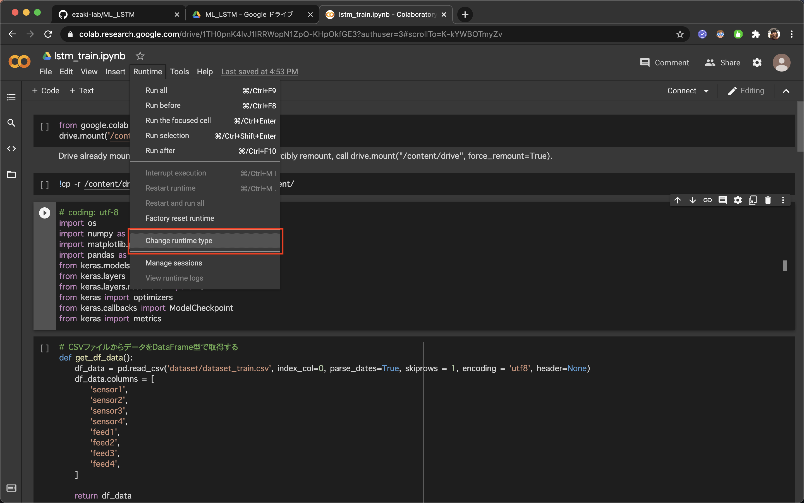

# ML_LSTM

## 使い方（Train）

1. "Clone"を選択し、"Download ZIP"を押してダウンロードする。

2. ダウンロードしたzipファイルを解凍し、GoogleドライブのROOTディレクトリに解凍したディレクトリをおく。

ROOTディレクトリに置く理由は、プログラム上でそのように定義してあるから。その箇所を書き換えれば、その他のディレクトリでも問題ない。

3. 「lstm_train.ipynb」を右クリックして、「アプリを開く」＞「Google Colaboratory」を選択する。

4. 「Runtime」タブの「Change Runtime Type」を選択する。

5. GPUを選択し、保存する。

6. 「Connect」を選択する。

7. 「Runtime」タブの「Run all」を選択する。

8. 図のように、実行される。初めて実行するとき、Googleドライブへのアクセスを聞かれるが、URLを選択し、アカウントを選択する。その後、表示されるKEYをコピーし、Colabの入力欄に入力する。

9. 実行終了後、学習済みのモデルがGoogleドライブにコピーされているのを確認する。

## 使い方（Predict）

trainと同様に実行すると、result_predict.csvがそれぞれのディレクトリに保存される。

## メモ

- 学習するデータはdatasetの中にある。
- 学習するモデルはLSTM_1とLSTM_2のふたつを準備している。これはプログラムを修正して追加・削除が可能。
